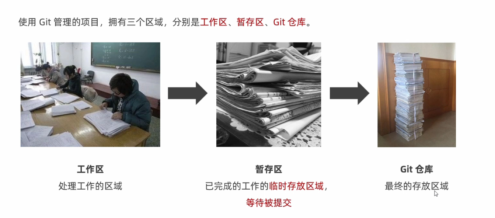
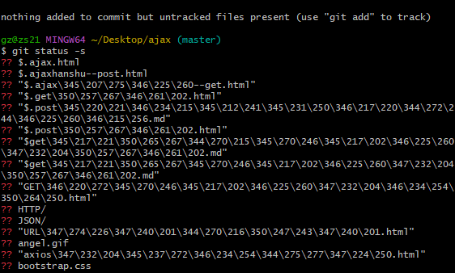
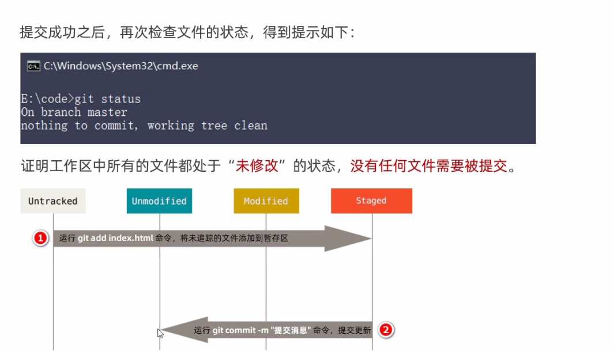
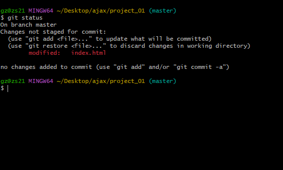
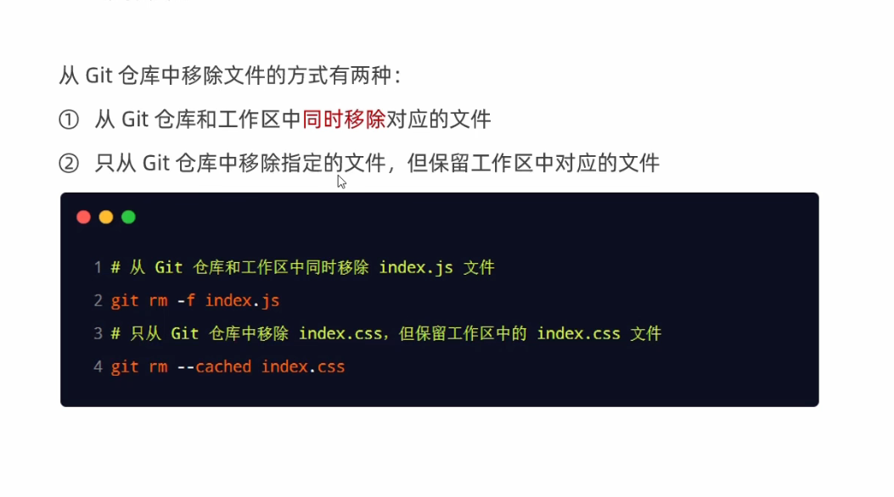

### Git的记录快照
- Git快照是在原有文件版本的基础上重新生成一份备份文件，类似于备份。为了效率，
如果文件没有修改，Git不在重新存储该文件，而是只保留一个链接指向之前存储的文件。

缺点：占用磁盘空间较大
优点：版本切换时非常快，因为每个版本都是完整的文件快照，切换版本时直接恢复目标版本的快照即可

<table><tr><td bgcolor=DarkSeaGreen>特点：空间换时间</td></tr></table> 

在Git中的绝大多数操作都只需要访问本地文件和资源，一般不需要来自网络上其他计算机的信息

特性：
1.  断网后依旧可以在本地对项目进行版本管理
2.  联网后，把本地修改的记录同步到云端服务器即可

### Git中的三种区域

工作区、暂存区、Git仓库

### Git中的三种状态

注意：
- 如果Git仓库中保持着特定版本的文件，就是已提交状态

### Git创建仓库
`git init`

### Git工作区中文件的4种状态

Git操作的终极结果：让工作区中的文件都处于“未修改”的状态

### Git查看文件状态
`git status`

- 以精简的方式显示文件状态
`git status -s`

??表示 untracked
- 将未追踪文件添加到暂存区
`git add`
`git commit -m'提交信息'`  提交更新

### 对已提交的文件进行修改
对index.html进行修改后，运行`git status`命令

Changes not staged for commit:
说明已跟踪文件的内容发生了变化，但还没有放到暂存区
注意：

- 修改过的、没有放入暂存区的文件前面有红色的<b>M</b>标记
- 修改过的、放入暂存区的文件前面有绿色的<b>M</b>标记

再次运行`git commit -m'提交信息'` 提交git仓库

### 撤销对文件的修改
`git checkout -- 文件名.后缀 `
操作的结果：所有的修改会丢失，且无法恢复！<b>危险性比较高，请谨慎操作!</b>
<b>撤销操作的本质：</b>用Git仓库中保存的文件，覆盖工作区中指定的文件

### 向暂存区中一次性添加多个文件
<table><tr><td bgcolor=DarkSeaGreen>`git add .`</td></tr></table>
<b>会经常使用这个命令</b>

### 取消暂存的文件
`git reset HEAD 文件名`
`git reset HEAD .` 移除暂存区的全部文件
### 跳过暂存区直接提交文件
`git commit -a -m'value'`

### 移除文件

### 忽略文件
1. #开头的是注释
2. /结尾的是目录
3. /开头防止递归 （/TODO只忽略当前目录下的TODO文件,而不忽略subdir/TODO）
4. !开头表示取反
5. 可以使用glob模式进行文件和文件夹的匹配(glob模式指简化了的正则表达式)

- glob模式
  1. *匹配零个或多个任意字符
  2. [abc]表示匹配任意一个列在方括号中的支付（此案例匹配一个a或b或c）
  3. ?表示只匹配一个字符
  4. [0-9]表示匹配所有0到9的数字
  5. **表示匹配任意中间目录（比如`a/**/z`可以匹配a/z、a/b/z、a/b/c/z等）
  
### 查看提交历史
`git log`

`git log - 2 --pretty=oneline`在一行展示最近两条提交历史的信息

`git reflog --pretty=oneline` 在<b>旧版本</b>中查看完整的命令操作的历史

`git reset --hard <CommitID>` 根据指定的提交ID回退到指定版本 

