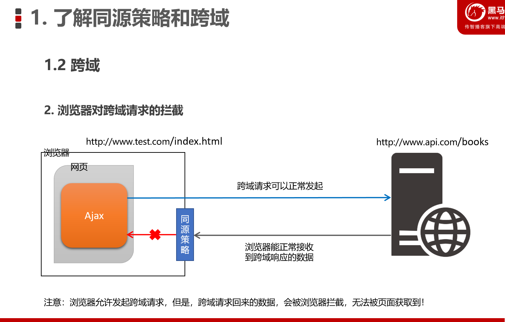

### 如果两个页面的协议、域名和端口号都相同，则两个页面具有相同的源  
&nbsp;
&nbsp;
&nbsp;

### 同源指的是两个URL的协议、域名、端口一致，反之，则是跨域
- 出现跨域的根本原因：浏览器的同源策略不允许非同源的URL之前进行资源的交互
&nbsp;
&nbsp;
&nbsp;

### 同源策略

&nbsp;
&nbsp;
&nbsp;

### 如何实现跨域的数据请求
- JSONP: 兼容性好(兼容低版本IE),只支持GET请求,不支持POST请求
- CORS: 出现的较晚，W3C 标准，属于跨域 Ajax 请求的根本解决方案。支持 GET 和 POST 请求。缺点是不兼容某些低版本的浏览器。

### JSONP的缺点
- 由于JSONP是通过`<scirpt>`标签的src属性，来实现跨域数据获取的,所以，JSONP不支持POST请求

- 注意：JSONP 和 Ajax 之间没有任何关系，不能把 JSONP 请求数据的方式叫做 Ajax，因为 JSONP 没有用到 XMLHttpRequest 这个对象。

